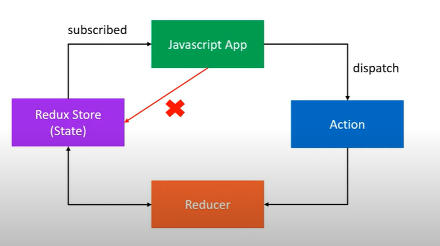

# Redux

## Define Redux

### Redux is a predictable state container for JavaScript apps.

1. It is for JavaScript apps
2. It is a state container
3. It is predictable

### Redux is for JavaScript applications

- Redux is not tied to React.
- It can be used with any UI library or framework such as React, Angular, Vue, or even vanilla JavaScript.
- Redux is an library for JavaScript applications.

### Redux is a state container

- Redux store the state of your application.
- State of an application simply mean the state shared by all the individual components of that app.
- Redux will store and manage the application state.

### Redux is predictable

- Redux is a state container.
- The state of the application can change.
- For ex: In a todo list app - item (**pending**) --> item (**completed**).
- In redux, a pattern is enforced to ensure all state transitions are explicit and can be tracked.
- Thus, the changes to your application's state become predictable.

## The Three Core Concepts in Redux

| Cake Shop Scenario    | Redux     | Purpose                             |
| --------              | -------   | -------                             |
| Shop                  | `store`   | Hold the state of your application  |
| Cake Ordered          | `action`  | Describe what happened              |
| Shopkeeper            | `reducer` | Ties the store and actions together |

1. A **`store`** that holds the state of your application.
2. An **`action`** that describe what happened in the application.
   - The only way your application can interact with the store.
3. A **`reducer`** which handles the action and decides how to handle the state.

## The Three Fundamental Principle of Redux

The three princple basically describe the redux pattern. In other word, it descibe how to write code base on the three core concepts.

### First Principle: `Store`

- **"The global state of your application is store as an object inside a single store"**
- Maintain our application state in a single object which would be managed by the Redux store.
- Responsibilities:
  - Holds application state.
  - Provide a method to allow access to state via `getState()`. Returns the current state its holds.
  - Provide a method to allows state to be updated via `dispatch(action)`.
  - Allow applicatiosn to register listeners via `subscribe(listener)`. Listener is a function which is invoked anytime there's an update in the redux store (state).
  - Handles un-registering of listeners via the function return by `subscribe(listener)` method.
- For example:

    ```javascript
        // Cake Shop:
        // Tracking the number of cakes on the self in a cake-shop
        {
            numberOfCaked: 10
        }
    ```

### Second Principle: `Action`

- **"The only way to change the state is to dispatch an action, an object that describes what happened"**
- To update the state of your application, you need to let Redux know about that with an action.
- Not allowed to directly udpate the state object.
- The state is readonly and the only way to change the state is to emmit an action which is an object describing what happened.
- Action is the only way your application can interact with the store.
- Action carry some information from your app to the redux store.
- Action are plain JavaScript objects.
  - Must have a `type` property that describes something that happened in the application.
  - The `type` property is typically defined as string constants.
- For Example:

    ```javascript
        // Cake Shop:
        // The only way to order a cake, is through
        // Scanning the OR code and place an order - CAKE_ORDERED
        {
            type: 'CAKE_ORDERED',
            payload: any // (options) carry information with action
        }
    ```

### Third Principle: `Reducer`

- **"To specify how the state tree is updated baseed on actions, you write pure reducers"**
- Pure reducers are basically pure functions that accept previous-state and action as arguments, and return the next-state (new-state) of the application.
- Reducer - `(previousState, action) => newState`
- Reducers specify how the applications state changes in response to actions send to the store.
- **Actions** only describe **WHAT** happended, whereas **Reducer** describe **HOW** the application state changes.
- For example:

    ```javascript
        // Cake Shop:
        // Reducer is the shopkeeper
        const reducer = (state = initialState, action) => {
            switch(action.type) {
                case `CAKE_ORDERED`:
                    return {
                        numberOfCakes: state.numberOfCakes - 1
                    }
                case 'default':
                    return state;
            }
        }
    ```

  

## Q&A

**Q. What is Redux?**

A. Redux is a predictable state container for JavaScript apps.

**Q. Why Redux?**

A.
If you want to manage the global state of your application in a predictable way, redux cna help you.

The patterns and tools provided by Redux make it easier to understand when, where, why, and how the state in your application is being updated, and how your application logic will behave when those changes occur.

Redux guides you toward writing code that is predictable and testable, whcih helps give you confidence that your application will work as expected.
